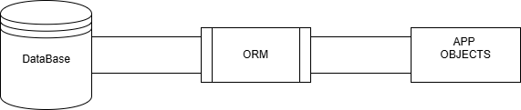
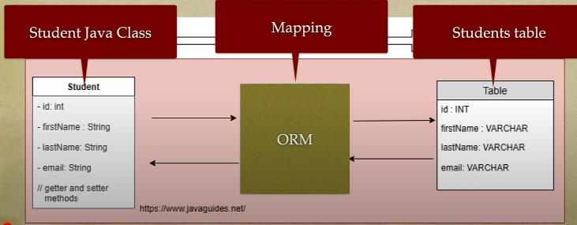
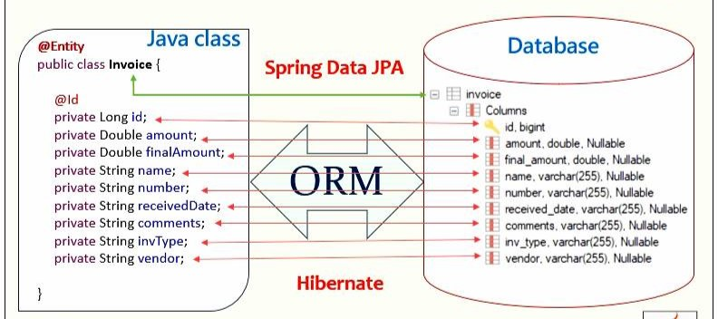

# ORM NEDİR ?

### Giriş
Birçok uygulama, ilişkisel veritabanları (RDBMS) kullanarak veri depolar. Ancak, uygulama geliştiricileri veritabanları ile etkileşimde bulunurken, SQL sorgularını manuel olarak yazmak ve yönetmek oldukça zaman alıcı ve hataya açık olabilir. İşte bu noktada Object-Relational Mapping (ORM) devreye girer.

**Object-Relational Mapping (ORM)**, bir yazılımda kullanılan nesne tabanlı model ile veritabanındaki ilişkisel veri yapıları arasında bir köprü kuran bir yazılım teknolojisidir.





ORM, nesne yönelimli programlama (OOP) dilinde yazılmış olan bir uygulamanın, ilişkisel veritabanındaki verilerle etkileşimde bulunmasını sağlar.





Bu etkileşim, SQL sorguları yerine nesneler üzerinden gerçekleştirilir. ORM, yazılım geliştiricilerinin SQL ile uğraşmadan, yalnızca nesne tabanlı programlama dillerini kullanarak veritabanı işlemlerini gerçekleştirmelerine olanak tanır.



ORM, veritabanındaki her tabloyu bir sınıf (class) ile eşler. Bu sınıflar, tablodaki veriyi nesne olarak temsil eder. Örneğin, invoice adlı bir tablonun karşılığı olan Invoice sınıfı, tablodaki her bir kaydı bir Invoice nesnesi olarak temsil eder.


| Dil         | ORM Araçları                          |
|------------|--------------------------------------|
| **PHP**    | Eloquent, Doctrine, Propel         |
| **JavaScript / TypeScript** | Sequelize, TypeORM, Prisma  |
| **Python** | SQLAlchemy, Django ORM, Peewee     |
| **Java**   | Hibernate, EclipseLink, MyBatis    |
| **C# (.NET)** | Entity Framework, Dapper       |
| **Ruby**   | ActiveRecord, Sequel              |
| **Go**     | GORM, Ent                         |
| **Kotlin** | Exposed, Hibernate                |


Aşağıda kısa bir Eloguent(PHP) Örneği bulunmaktadır. [MVC](https://github.com/xBugor/MVC "MVC NEDİR") sisteminin okunması önerilir.

1. Modeli Oluşturma
```php

namespace App\Models;  // Modelin App\Models dizini içinde olduğunu belirtir.
 


use Illuminate\Database\Eloquent\Factories\HasFactory; // HasFactory: Laravel'in Factory özelliğini kullanarak sahte test verileri oluşturmayı sağlar.

use Illuminate\Database\Eloquent\Model;//Eloquent ORM özelliklerini kullanmasını sağlar.

//User modeli, Model sınıfını miras alır, böylece veritabanı işlemleri için Eloquent ORM kullanılır.
// Kısaca User database oluşturma
class User extends Model
{
    use HasFactory;

    // Veritabanına eklenebilir alanları tanımlıyoruz
    protected $fillable = ['name', 'email', 'password'];
}
```
2. Veri Ekleme (Insert - Create)
```php
use App\Models\User;

// Yeni bir kullanıcı oluştur ve kaydet
User::create([
    'name' => 'Buğra Bayrakci',
    'email' => 'bugrahanbayrakci@gmail.com',
    'password' => bcrypt('123456'), // Şifreyi güvenli hale getiriyoruz
]);
```

3. Veri Okutma işlemi (Retrieve - Get - Find)
```php

$users = User::all();  // Bütün kullanıcıları getirir

foreach ($users as $user) {
    echo $user->name . ' - ' . $user->email . '<br>';
}
```
belirli bir ID sahip verileri getir
```php

$user = User::find(1); // ID'si 1 olan kullanıcıyı getirir
echo $user->name;
```
4. Veri Güncelleme (Update)
```php

$user = User::find(1);
$user->name = 'Bugra Bayrak';
$user->save();
```


### **ORM (Object-Relational Mapping) Avantajları ve Dezavantajları**

| **Avantajlar** | **Dezavantajlar** |
|--------------|--------------|
| **SQL yazma zorunluluğunu azaltır** → ORM, SQL sorgularını otomatik oluşturur, manuel SQL yazmaya gerek kalmaz. | **Performans düşebilir** → ORM, doğrudan SQL sorgularına göre daha fazla kaynak tüketebilir. |
| **Kodun okunabilirliğini artırır** → Nesne yönelimli bir yapı sunduğu için kod daha anlaşılır ve düzenli olur. | **Öğrenme eğrisi** → ORM kullanımı için belirli bir öğrenme süreci gereklidir. |
| **Güvenlik sağlar** → SQL Injection gibi güvenlik açıklarına karşı koruma sunar. | **Özel SQL optimizasyonları zor olabilir** → ORM bazen veritabanı özelinde optimizasyonları zorlaştırabilir. |
| **Bakımı kolaylaştırır** → Veri modeli değişikliklerinde tek bir noktadan güncelleme yapma imkanı sunar. | **Bazı gelişmiş sorgularda kısıtlamalar olabilir** → ORM, çok kompleks sorgular için esneklik sağlayamayabilir. |
| **Veritabanı bağımsızlığı sağlar** → Farklı veritabanlarına kolayca uyarlanabilir. | **Gereksiz sorgular oluşturabilir** → ORM bazen gereksiz ya da fazla sorgular çalıştırabilir. |


# Kaynakça

[Java Guides](https://youtu.be/KthQ0UmBmxE?si=-LJLf2dqIfJxkfiG)

[Medium](https://medium.com/kodluyoruz/orm-nedir-orm-araçları-ve-yaklaşımları-nelerdir-37af94ee873c)

[Laravel Docs](https://laravel.com/docs/5.0/eloquent)

[Laracast](https://laracasts.com)